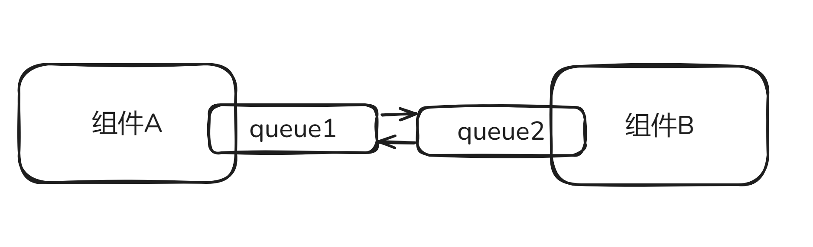
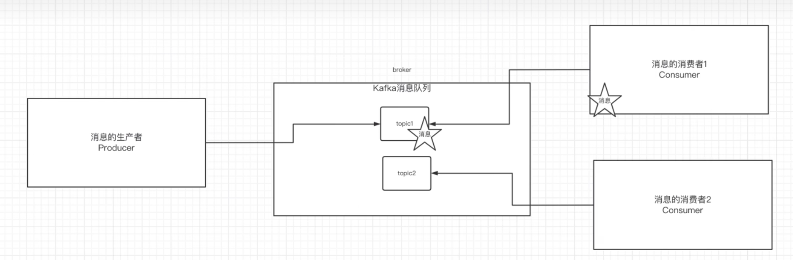

--- 
# 一、消息队列的流派
## 1. 什么是消息队列

kafka自定义了一套应用层的通讯协议，帮助各组件之间屏蔽了复杂的底层通讯（HTTP、TCP）。用简单的生产者-消费者模型代替了复杂的通讯协议。
## 2. 有Broker MQ
有Broker作为消息的中转站
### 重Topic
Broker依据Topic进行消息的中转
- kafka
- rocketmq（阿里基于开源kafka的原理编写）
- activeMq
### 轻Topic
Topic只是一种中转模式
- RabbitMQ

## 3. 无BrokerMQ
代表ZeroMq，作者意识到MQ的本质是一个更高级的Socket，是为了解决通讯问题的，所以zeroMq被设计成了一个库而不是中间件，没有Broker的存在

节点之间通讯的消息都是发送到彼此的quene中，每个节点既是生产者又是消费者，ZeroMq做的事情就是封装了一套类似Socket的Api可以即发送数据，又可以读取数据

---

# 二、kafka介绍

### 1. kafka基本概念

| 名称       | 解释                                                 |
| -------- | -------------------------------------------------- |
| Broker   | 消息中间件处理节点，一个Kafka节点就是一个Broker，一个或多个Broker组成kafka集群 |
| Topic    | kafka根据topic对消息进行分类                                |
| Producer | 消息生产者                                              |
| Consumer | 消息消费者                                              |

